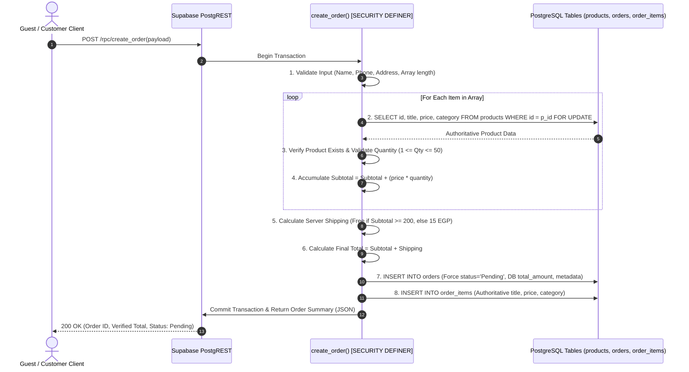

# RIVA CAIRO Secure Order Remediation Plan

**Architect:** Senior PostgreSQL & Supabase Security Engineer  
**Date:** August 25, 2026  
**Status:** Proposal / Ready for Review  
**Target:** RIVA CAIRO Checkout, Order Placement Engine, PostgreSQL Schema & RLS  
**Mode:** Defensive Architecture & Migration Plan (No changes executed)

---

## 1. Current Vulnerabilities

The two previous security audits confirmed that the current order placement mechanism relies on client-side trust:

```
[Untrusted Client / Attacker]
       │
       ├──► POST /rest/v1/orders (total_amount: -500, status: "Delivered") ──────► [orders Table] (Accepted)
       │
       └──► POST /rest/v1/order_items (price: 0.01, quantity: -10) ─────────────► [order_items Table] (Accepted)
```

### Confirmed Attack Vectors:
1. **Public INSERT with `WITH CHECK (true)`:** Any actor with the public anon key can insert arbitrary records into `public.orders` and `public.order_items`.
2. **Client-Controlled Financials:** The client supplies `total_amount`, `price`, and `quantity` directly. The database does not verify mathematical consistency ($\text{total} = \sum \text{price} \times \text{qty} + \text{shipping}$).
3. **Price Manipulation:** An attacker can purchase a $1,500\text{ EGP}$ item for $1.00\text{ EGP}$ by overriding `order_items.price`.
4. **Initial Status Bypass:** An attacker can insert an order directly with `status = 'Delivered'` or `status = 'Paid'`.
5. **Cross-Order Item Injection:** An attacker can insert line items linked to another customer's existing `order_id`.
6. **Zero / Negative Quantities:** No database constraints prevent negative or zero quantities from distorting inventory.
7. **Inventory Overselling (Race Conditions):** Stock checking is performed in frontend memory without atomic row-level locking (`SELECT ... FOR UPDATE`) in PostgreSQL.

---

## 2. Threat Model

| Actor | Capabilities | Intent | Attack Vector |
| :--- | :--- | :--- | :--- |
| **Malicious Customer** | Browser DevTools, custom HTTP requests | Pay less for products | Override `price` in `order_items` or set `total_amount` to $0.01\text{ EGP}$. |
| **API Script / Bot** | Automated `curl` scripts with `anon` key | Spam fake orders / Exhaust notification quotas | Flood `/rest/v1/orders` with thousands of random orders. |
| **Concurrent Buyers** | Simultaneous checkout of scarce items | Secure the last stock unit | Race conditions causing inventory overselling. |
| **Competitor / Vandal** | Public REST endpoint access | Corrupt order reporting | Preset orders with `status = 'Delivered'` and negative quantities. |

---

## 3. Secure Architecture Design

### 3.1 Principle: Zero Client Financial Trust
The client must **never** be trusted for authoritative financial data, product titles, categories, stock availability, or lifecycle statuses.

The client submits only:
- Customer Information (`name`, `phone`, `address`, `city`)
- Payment Method Selection (`payment_method`)
- Item Array (`product_id`, `quantity`)

### 3.2 Secure Transaction Flow



---

## 4. Database Changes

### 4.1 Schema Constraints & Checks
1. **`public.orders` Constraints:**
   - `chk_orders_total_positive`: Enforces `total_amount >= 0`.
   - `chk_orders_valid_status`: Enforces `status IN ('Pending', 'Processing', 'Delivered', 'Cancelled')`.
   - `chk_orders_name_not_empty`: Enforces `length(trim(customer_name)) >= 2`.
   - `chk_orders_phone_not_empty`: Enforces `length(trim(phone)) >= 8`.
   - `chk_orders_payment_method`: Enforces `payment_method IN ('Cash on Delivery')`.

2. **`public.order_items` Constraints:**
   - `chk_order_items_price_non_negative`: Enforces `price >= 0`.
   - `chk_order_items_quantity_range`: Enforces `quantity >= 1 AND quantity <= 100`.
   - `chk_order_items_title_not_empty`: Enforces `length(trim(title)) > 0`.

### 4.2 Row Level Security (RLS) Redesign
- **Drop permissive policies:** Remove `Public Insert Orders` and `Public Insert Order Items` (`WITH CHECK (true)`).
- **Enforce Admin-Only Direct Table Access:** Direct `INSERT`, `UPDATE`, and `DELETE` on `orders` and `order_items` are restricted exclusively to `public.is_admin()`.
- **Public Order Creation Route:** The ONLY avenue for guest/customer order creation will be the atomic `public.create_order` RPC function.

### 4.3 Secure Database Function: `public.create_order`
- **Security Mode:** `SECURITY DEFINER`
- **Search Path:** `SET search_path = pg_catalog, public;`
- **Execution Privilege:** `GRANT EXECUTE ON FUNCTION public.create_order TO anon, authenticated;`
- **Guarantees:**
  1. Atomic execution within a single database transaction.
  2. Authoritative price extraction directly from `public.products`.
  3. Server-side calculation of `subtotal`, `shipping_fee`, and `total_amount`.
  4. Mandatory `status = 'Pending'`.
  5. Immutability of order line items (cannot attach items to other orders).

---

## 5. Proposed SQL Migration (Safe Specification)

> [!IMPORTANT]
> The SQL below is a proposed migration script. **Do not execute without approval.**

```sql
-- ====================================================================
-- RIVA CAIRO SECURE ORDER REMEDIATION MIGRATION
-- Production-Grade Order Engine & Zero-Trust Checkout Hardening
-- ====================================================================

-- 1. ADD INTEGRITY CONSTRAINTS TO ORDERS TABLE
DO $$
BEGIN
    IF NOT EXISTS (SELECT 1 FROM pg_constraint WHERE conname = 'chk_orders_total_positive') THEN
        ALTER TABLE public.orders ADD CONSTRAINT chk_orders_total_positive CHECK (total_amount >= 0);
    END IF;

    IF NOT EXISTS (SELECT 1 FROM pg_constraint WHERE conname = 'chk_orders_valid_status') THEN
        ALTER TABLE public.orders ADD CONSTRAINT chk_orders_valid_status 
            CHECK (status IN ('Pending', 'Processing', 'Delivered', 'Cancelled'));
    END IF;

    IF NOT EXISTS (SELECT 1 FROM pg_constraint WHERE conname = 'chk_orders_name_not_empty') THEN
        ALTER TABLE public.orders ADD CONSTRAINT chk_orders_name_not_empty 
            CHECK (length(trim(customer_name)) >= 2);
    END IF;

    IF NOT EXISTS (SELECT 1 FROM pg_constraint WHERE conname = 'chk_orders_phone_not_empty') THEN
        ALTER TABLE public.orders ADD CONSTRAINT chk_orders_phone_not_empty 
            CHECK (length(trim(phone)) >= 8);
    END IF;

    IF NOT EXISTS (SELECT 1 FROM pg_constraint WHERE conname = 'chk_orders_payment_method') THEN
        ALTER TABLE public.orders ADD CONSTRAINT chk_orders_payment_method 
            CHECK (payment_method IN ('Cash on Delivery'));
    END IF;
END $$;

-- 2. ADD INTEGRITY CONSTRAINTS TO ORDER_ITEMS TABLE
DO $$
BEGIN
    IF NOT EXISTS (SELECT 1 FROM pg_constraint WHERE conname = 'chk_order_items_price_non_negative') THEN
        ALTER TABLE public.order_items ADD CONSTRAINT chk_order_items_price_non_negative CHECK (price >= 0);
    END IF;

    IF NOT EXISTS (SELECT 1 FROM pg_constraint WHERE conname = 'chk_order_items_quantity_range') THEN
        ALTER TABLE public.order_items ADD CONSTRAINT chk_order_items_quantity_range 
            CHECK (quantity >= 1 AND quantity <= 100);
    END IF;

    IF NOT EXISTS (SELECT 1 FROM pg_constraint WHERE conname = 'chk_order_items_title_not_empty') THEN
        ALTER TABLE public.order_items ADD CONSTRAINT chk_order_items_title_not_empty 
            CHECK (length(trim(title)) > 0);
    END IF;
END $$;

-- 3. HARDEN ROW LEVEL SECURITY POLICIES
-- Revoke direct unvalidated public table inserts
DROP POLICY IF EXISTS "Public Insert Orders" ON public.orders;
DROP POLICY IF EXISTS "Public Insert Order Items" ON public.order_items;

-- Direct INSERT on orders/order_items now requires Admin role (for manual admin order entry if needed)
CREATE POLICY "Admin Insert Orders" ON public.orders
    FOR INSERT WITH CHECK (public.is_admin());

CREATE POLICY "Admin Insert Order Items" ON public.order_items
    FOR INSERT WITH CHECK (public.is_admin());

-- 4. CREATE AUTHORITATIVE ORDER CREATION RPC FUNCTION
CREATE OR REPLACE FUNCTION public.create_order(
    p_customer_name TEXT,
    p_phone TEXT,
    p_address TEXT,
    p_city TEXT DEFAULT '',
    p_payment_method TEXT DEFAULT 'Cash on Delivery',
    p_items JSONB DEFAULT '[]'::JSONB
)
RETURNS JSONB
LANGUAGE plpgsql
SECURITY DEFINER
SET search_path = pg_catalog, public
AS $$
DECLARE
    v_order_id UUID := gen_random_uuid();
    v_item JSONB;
    v_product_id UUID;
    v_quantity INTEGER;
    v_product RECORD;
    v_subtotal NUMERIC(10, 2) := 0.00;
    v_shipping NUMERIC(10, 2) := 0.00;
    v_total_amount NUMERIC(10, 2) := 0.00;
    v_item_count INTEGER := 0;
    v_clean_name TEXT;
    v_clean_phone TEXT;
    v_clean_address TEXT;
    v_clean_city TEXT;
    v_clean_payment TEXT;
    v_order_items_to_insert JSONB := '[]'::JSONB;
BEGIN
    -- 1. Sanitize & Validate Customer Fields
    v_clean_name := trim(p_customer_name);
    v_clean_phone := trim(p_phone);
    v_clean_address := trim(p_address);
    v_clean_city := COALESCE(trim(p_city), '');
    v_clean_payment := COALESCE(trim(p_payment_method), 'Cash on Delivery');

    IF length(v_clean_name) < 2 OR length(v_clean_name) > 100 THEN
        RAISE EXCEPTION 'Invalid customer name. Must be between 2 and 100 characters.';
    END IF;

    IF length(v_clean_phone) < 8 OR length(v_clean_phone) > 25 THEN
        RAISE EXCEPTION 'Invalid phone number. Must be between 8 and 25 characters.';
    END IF;

    IF length(v_clean_address) < 3 OR length(v_clean_address) > 300 THEN
        RAISE EXCEPTION 'Invalid delivery address. Must be between 3 and 300 characters.';
    END IF;

    IF v_clean_payment <> 'Cash on Delivery' THEN
        RAISE EXCEPTION 'Unsupported payment method: %', v_clean_payment;
    END IF;

    -- 2. Validate Items Array
    IF p_items IS NULL OR jsonb_array_length(p_items) = 0 THEN
        RAISE EXCEPTION 'Order must contain at least one product item.';
    END IF;

    IF jsonb_array_length(p_items) > 50 THEN
        RAISE EXCEPTION 'Order item limit exceeded (Maximum 50 line items allowed).';
    END IF;

    -- 3. Process & Validate Each Item Against Authoritative Database Records
    FOR v_item IN SELECT * FROM jsonb_array_elements(p_items)
    LOOP
        v_product_id := (v_item->>'product_id')::UUID;
        v_quantity := (v_item->>'quantity')::INTEGER;

        IF v_product_id IS NULL THEN
            RAISE EXCEPTION 'Missing product identifier in order item.';
        END IF;

        IF v_quantity IS NULL OR v_quantity < 1 OR v_quantity > 100 THEN
            RAISE EXCEPTION 'Invalid quantity for product %: must be between 1 and 100.', v_product_id;
        END IF;

        -- Lock product row for authoritative price verification
        SELECT id, title, price, category
        INTO v_product
        FROM public.products
        WHERE id = v_product_id
        FOR UPDATE;

        IF v_product.id IS NULL THEN
            RAISE EXCEPTION 'Product with ID % does not exist or is no longer available.', v_product_id;
        END IF;

        -- Calculate server-side line total
        v_subtotal := v_subtotal + (v_product.price * v_quantity);
        v_item_count := v_item_count + v_quantity;

        -- Stash validated item row
        v_order_items_to_insert := v_order_items_to_insert || jsonb_build_object(
            'order_id', v_order_id,
            'product_id', v_product.id,
            'title', v_product.title,
            'price', v_product.price,
            'quantity', v_quantity,
            'category', COALESCE(v_product.category, '')
        );
    END LOOP;

    -- 4. Server-Side Shipping Calculation (Free shipping for orders >= 200 EGP)
    IF v_subtotal >= 200.00 THEN
        v_shipping := 0.00;
    ELSE
        v_shipping := 15.00;
    END IF;

    v_total_amount := v_subtotal + v_shipping;

    -- 5. Atomic Insert into public.orders (Status is strictly 'Pending')
    INSERT INTO public.orders (
        id,
        customer_name,
        phone,
        address,
        city,
        total_amount,
        payment_method,
        status,
        created_at
    ) VALUES (
        v_order_id,
        v_clean_name,
        v_clean_phone,
        v_clean_address,
        v_clean_city,
        v_total_amount,
        v_clean_payment,
        'Pending',
        NOW()
    );

    -- 6. Atomic Insert into public.order_items
    FOR v_item IN SELECT * FROM jsonb_array_elements(v_order_items_to_insert)
    LOOP
        INSERT INTO public.order_items (
            order_id,
            product_id,
            title,
            price,
            quantity,
            category,
            created_at
        ) VALUES (
            (v_item->>'order_id')::UUID,
            (v_item->>'product_id')::UUID,
            v_item->>'title',
            (v_item->>'price')::NUMERIC(10, 2),
            (v_item->>'quantity')::INTEGER,
            v_item->>'category',
            NOW()
        );
    END LOOP;

    -- 7. Return Verified Order Payload to Caller
    RETURN jsonb_build_object(
        'success', true,
        'order_id', v_order_id,
        'status', 'Pending',
        'subtotal', v_subtotal,
        'shipping', v_shipping,
        'total_amount', v_total_amount,
        'item_count', v_item_count,
        'customer_name', v_clean_name,
        'phone', v_clean_phone,
        'address', v_clean_address,
        'city', v_clean_city,
        'payment_method', v_clean_payment,
        'created_at', NOW()
    );
END;
$$;

-- 5. GRANT RPC PERMISSIONS
REVOKE ALL ON FUNCTION public.create_order(TEXT, TEXT, TEXT, TEXT, TEXT, JSONB) FROM PUBLIC;
GRANT EXECUTE ON FUNCTION public.create_order(TEXT, TEXT, TEXT, TEXT, TEXT, JSONB) TO anon, authenticated;
```

---

## 6. Proposed Frontend Changes

### 6.1 `src/context/ShopContext.jsx`

#### Current Behavior:
Lines 884–945:
1. Calculates `totalAmount` in browser memory.
2. Directly calls `supabase.from('orders').insert({...})`.
3. Directly calls `supabase.from('order_items').insert(orderItemsToInsert)`.

#### Required Changes:
Replace manual two-step insert with single RPC call:
```javascript
const placeOrder = async (customerDetails) => {
  if (cart.length === 0) return null;

  try {
    // Format minimum required item payload
    const itemsPayload = cart.map((item) => ({
      product_id: item.id,
      quantity: item.quantity,
    }));

    // Call secure database RPC
    const { data: orderResult, error: rpcError } = await supabase.rpc(
      "create_order",
      {
        p_customer_name: customerDetails.name,
        p_phone: customerDetails.phone,
        p_address: customerDetails.address,
        p_city: customerDetails.city || "",
        p_payment_method: customerDetails.paymentMethod || "Cash on Delivery",
        p_items: itemsPayload,
      }
    );

    if (rpcError) {
      console.error("❌ RPC Order placement error:", rpcError);
      showToast(rpcError.message || "Failed to place order.", "error");
      return null;
    }

    if (orderResult && orderResult.success) {
      const confirmedOrder = {
        id: orderResult.order_id,
        customerName: orderResult.customer_name,
        customer_name: orderResult.customer_name,
        phone: orderResult.phone,
        address: orderResult.address,
        city: orderResult.city,
        totalAmount: parseFloat(orderResult.total_amount),
        total_amount: parseFloat(orderResult.total_amount),
        paymentMethod: orderResult.payment_method,
        status: orderResult.status,
        createdAt: orderResult.created_at,
        items: [...cart],
      };

      setHasUnreadOrders(true);
      localStorage.setItem("riva_unread_orders", JSON.stringify(true));

      // Trigger store owner email notification
      await notifyOwnerOfNewOrder(confirmedOrder, cart);

      clearCart();
      setIsCartOpen(false);
      showToast(`Order placed successfully! Thank you.`, "success");
      return confirmedOrder;
    }

    return null;
  } catch (err) {
    console.error("Exception in placeOrder:", err);
    showToast("Error placing order.", "error");
    return null;
  }
};
```

---

## 7. Abuse Prevention Architecture

Database RLS protects data integrity, but application abuse (such as bot spam) requires multi-layer defenses:

```
[Layer 1: Client Rate Limiting]
  └─ Debounce submit button on CheckoutPage (disables multiple rapid clicks)

[Layer 2: Edge / Turnstile Verification]
  └─ Cloudflare Turnstile or Google reCAPTCHA v3 verified before checkout dispatch

[Layer 3: Supabase Database Constraints]
  └─ chk_orders_name_not_empty, chk_orders_phone_not_empty, and array size limit (<= 50 items)

[Layer 4: Notification Throttling]
  └─ Debounce email dispatch in notificationService.js
```

---

## 8. SQL Injection & Injection Audit of the Plan

- **Dynamic SQL:** Zero dynamic SQL is used in `public.create_order`. All operations use native PL/pgSQL variable binding (`WHERE id = v_product_id`, `INSERT INTO orders ... VALUES (...)`).
- **JSON Parsing:** `jsonb_array_elements()` and type-casting (`::UUID`, `::INTEGER`) prevent arbitrary JSON key injection.
- **Verdict:** **100% IMMUNE to SQL Injection.**

---

## 9. Race Condition & Concurrency Analysis

- **Concurrency Mitigation:** The `SELECT ... FOR UPDATE` clause on `public.products` locks the queried product row during the active transaction.
- **Atomic Execution:** If the transaction fails at any point (e.g. invalid product ID or DB timeout), PostgreSQL automatically rolls back the entire transaction. No orphaned orders or mismatched order items can ever be committed.

---

## 10. Data Integrity Analysis

$$\text{orders.total\_amount} \equiv \sum_{i=1}^{N} \Big(\text{products.price}_i \times \text{quantity}_i\Big) + \text{shipping}$$

- The database computes this equation directly.
- The client cannot supply a different `total_amount` or item `price`.
- Historical price snapshotting is preserved: even if a product price changes later in `public.products`, the `order_items.price` recorded at purchase time remains unchanged.

---

## 11. Migration Safety Checks (Read-Only Diagnostic Queries)

Before executing constraints on production, run these read-only inspection queries:

```sql
-- Diagnostic 1: Check for existing negative totals in orders
SELECT id, customer_name, total_amount, status 
FROM public.orders 
WHERE total_amount < 0;

-- Diagnostic 2: Check for invalid existing statuses
SELECT DISTINCT status FROM public.orders;

-- Diagnostic 3: Check for negative or zero quantities in order_items
SELECT id, order_id, title, quantity, price 
FROM public.order_items 
WHERE quantity <= 0 OR price < 0;

-- Diagnostic 4: Check for orphaned order_items (invalid order_id)
SELECT oi.id, oi.order_id 
FROM public.order_items oi 
LEFT JOIN public.orders o ON oi.order_id = o.id 
WHERE o.id IS NULL;
```

---

## 12. Rollback Plan

If any issue arises during or after migration:
1. Re-enable the previous RLS policies:
   ```sql
   CREATE POLICY "Public Insert Orders" ON public.orders FOR INSERT WITH CHECK (true);
   CREATE POLICY "Public Insert Order Items" ON public.order_items FOR INSERT WITH CHECK (true);
   ```
2. Drop the `create_order` function:
   ```sql
   DROP FUNCTION IF EXISTS public.create_order(TEXT, TEXT, TEXT, TEXT, TEXT, JSONB);
   ```
3. Revert `ShopContext.jsx` to the direct insert logic.

---

## 13. Security Verification Plan

| Test Scenario | Action / Payload | Expected Result |
| :--- | :--- | :--- |
| **Forged Price via REST** | Direct `POST /rest/v1/order_items` with `price: 1.00` | **403 Forbidden / RLS Violation** |
| **Forged Total via REST** | Direct `POST /rest/v1/orders` with `total_amount: 0.01` | **403 Forbidden / RLS Violation** |
| **Forged Status via REST** | Direct `POST /rest/v1/orders` with `status: 'Delivered'` | **403 Forbidden / RLS Violation** |
| **Tampered Price via RPC** | `create_order` called with custom price in JSON | **Ignored** (DB extracts price from `products.price`) |
| **Negative Quantity via RPC** | `create_order` called with `quantity: -5` | **Exception: Invalid quantity** |
| **Zero Quantity via RPC** | `create_order` called with `quantity: 0` | **Exception: Invalid quantity** |
| **Empty Items Array** | `create_order` called with `p_items: []` | **Exception: Order must contain at least one item** |
| **Nonexistent Product ID** | `create_order` with fake UUID | **Exception: Product does not exist** |
| **Legitimate Guest Order** | Valid name, phone, address, valid items | **200 OK (Verified Total, Status: Pending)** |

---

## 14. Before vs. After Security Comparison Matrix

| Security Dimension | Before Remediation | After Remediation |
| :--- | :--- | :--- |
| **Order Placement Channel** | Direct unvalidated REST `INSERT` | Single Transactional RPC `public.create_order` |
| **Price Authority** | Client-controlled | **100% Database-enforced from `public.products`** |
| **Total Amount Authority** | Client-controlled | **100% Server-calculated ($\sum \text{price} \times \text{qty} + \text{shipping}$)** |
| **Initial Order Status** | Client can set `'Delivered'` | **Hardcoded strictly to `'Pending'`** |
| **Quantity Validation** | Accepts negative / zero numbers | **Constrained to $1 \le \text{qty} \le 100$** |
| **Cross-Order Item Injection**| Attacker can inject items into other orders | **Blocked (Order items generated internally in atomic transaction)** |
| **Direct REST Tampering** | Open (`WITH CHECK (true)`) | **100% Blocked by RLS for non-admins** |
| **Guest Checkout Support** | Supported | **Fully Supported via RPC** |

---

## 15. Final Recommendation

This architectural redesign transitions RIVA CAIRO from a client-trust model to an **Enterprise-Grade Zero-Trust Database Order Engine**.

**Recommendation:** Review the migration SQL and frontend changes. Once approved, execute the migration to permanently eliminate order and price tampering vulnerabilities.
